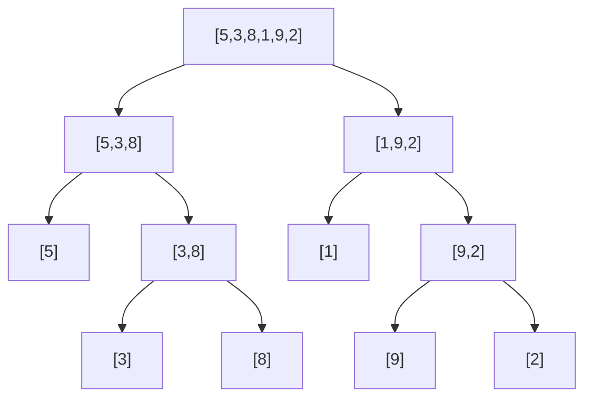

# 합병 정렬 (Merge Sort)

## 개념

**분할 정복 (Divide & Conquer)** 전략을 사용하는 정렬 알고리즘입니다.

1. **분할**: 배열을 절반으로 나눕니다.
2. **정복**: 각 절반을 재귀적으로 정렬합니다.
3. **합병**: 두 정렬된 배열을 하나로 합칩니다.



---

## 시간 복잡도

| 케이스 | 복잡도 |
|--------|--------|
| 최선 | O(n log n) |
| 평균 | O(n log n) |
| 최악 | O(n log n) |
| 공간 | O(n) |

> 항상 O(n log n)을 보장하는 **안정(Stable) 정렬**입니다.

---

## 구현 (C++)

```cpp
#include <cstdio>

const int MAXN = 100005;
int tmp[MAXN];

void merge(int arr[], int lo, int mid, int hi) {
    int i = lo, j = mid + 1, k = lo;
    while (i <= mid && j <= hi) {
        if (arr[i] <= arr[j])
            tmp[k++] = arr[i++];
        else
            tmp[k++] = arr[j++];
    }
    while (i <= mid) tmp[k++] = arr[i++];
    while (j <= hi)  tmp[k++] = arr[j++];
    for (int i = lo; i <= hi; i++)
        arr[i] = tmp[i];
}

void mergeSort(int arr[], int lo, int hi) {
    if (lo >= hi) return;
    int mid = (lo + hi) / 2;
    mergeSort(arr, lo, mid);
    mergeSort(arr, mid + 1, hi);
    merge(arr, lo, mid, hi);
}

int main() {
    int arr[] = {5, 3, 8, 1, 9, 2};
    int n = 6;
    mergeSort(arr, 0, n - 1);
    for (int i = 0; i < n; i++)
        printf("%d ", arr[i]);  // 1 2 3 5 8 9
    printf("\n");
    return 0;
}
```

---

## 제자리 합병 정렬 (In-place)

추가 공간 없이 구현하면 복잡도가 증가합니다. 보통 O(n) 추가 공간을 허용합니다.

---

## 역순 쌍 개수 세기 (Inversion Count)

합병 정렬을 응용하면 **역순 쌍(i < j이고 arr[i] > arr[j]인 쌍의 수)**을 O(n log n)에 셀 수 있습니다.

```cpp
#include <cstdio>

const int MAXN = 100005;
int tmp[MAXN];
long long invCount;

void mergeCount(int arr[], int lo, int mid, int hi) {
    int i = lo, j = mid + 1, k = lo;
    while (i <= mid && j <= hi) {
        if (arr[i] <= arr[j]) {
            tmp[k++] = arr[i++];
        } else {
            tmp[k++] = arr[j++];
            invCount += (mid - i + 1);  // 남은 left 원소 모두 역순 쌍
        }
    }
    while (i <= mid) tmp[k++] = arr[i++];
    while (j <= hi)  tmp[k++] = arr[j++];
    for (int i = lo; i <= hi; i++)
        arr[i] = tmp[i];
}

void sortCount(int arr[], int lo, int hi) {
    if (lo >= hi) return;
    int mid = (lo + hi) / 2;
    sortCount(arr, lo, mid);
    sortCount(arr, mid + 1, hi);
    mergeCount(arr, lo, mid, hi);
}

int main() {
    int arr[] = {5, 3, 8, 1};
    int n = 4;
    invCount = 0;
    sortCount(arr, 0, n - 1);
    printf("%lld\n", invCount);  // 4
    return 0;
}
```

---

## 연습 문제

- BOJ 2751 - 수 정렬하기 2
- BOJ 1517 - 버블 소트 (역순 쌍 개수)
- LeetCode 912 - Sort an Array
