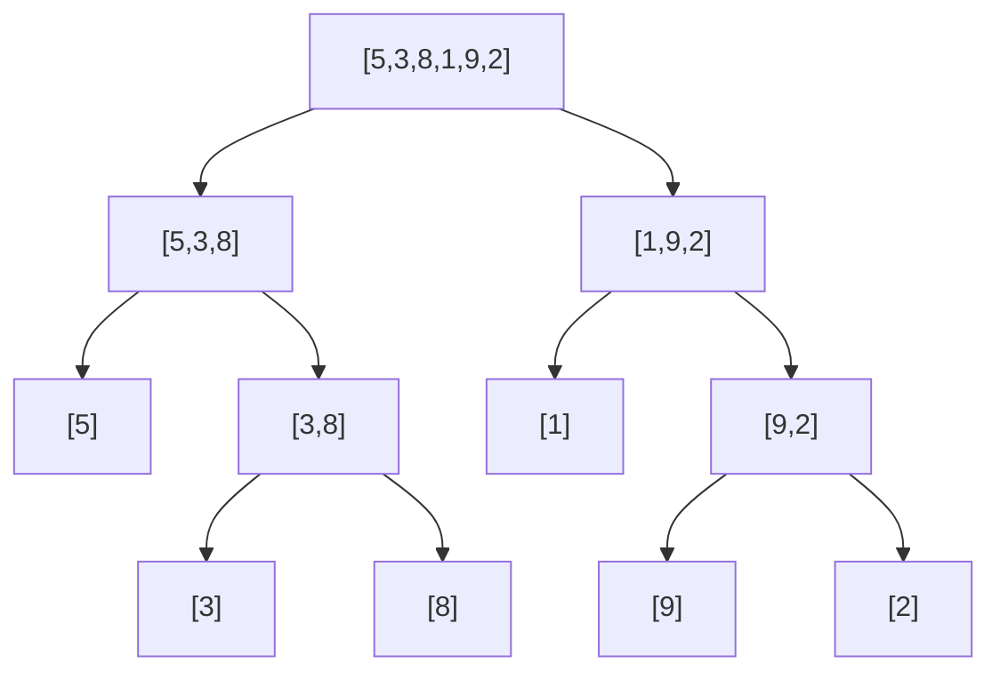

# 합병 정렬 (Merge Sort)

## 개념

**분할 정복 (Divide & Conquer)** 전략을 사용하는 정렬 알고리즘입니다.

1. **분할**: 배열을 절반으로 나눕니다.
2. **정복**: 각 절반을 재귀적으로 정렬합니다.
3. **합병**: 두 정렬된 배열을 하나로 합칩니다.



---

## 시간 복잡도

| 케이스 | 복잡도 |
|--------|--------|
| 최선 | O(n log n) |
| 평균 | O(n log n) |
| 최악 | O(n log n) |
| 공간 | O(n) |

> 항상 O(n log n)을 보장하는 **안정(Stable) 정렬**입니다.

---

## 구현 (Python)

```python
def merge_sort(arr):
    if len(arr) <= 1:
        return arr

    mid = len(arr) // 2
    left  = merge_sort(arr[:mid])
    right = merge_sort(arr[mid:])

    return merge(left, right)

def merge(left, right):
    result = []
    i = j = 0
    while i < len(left) and j < len(right):
        if left[i] <= right[j]:
            result.append(left[i])
            i += 1
        else:
            result.append(right[j])
            j += 1
    result.extend(left[i:])
    result.extend(right[j:])
    return result

arr = [5, 3, 8, 1, 9, 2]
print(merge_sort(arr))  # [1, 2, 3, 5, 8, 9]
```

---

## 제자리 합병 정렬 (In-place)

추가 공간 없이 구현하면 복잡도가 증가합니다. 보통 O(n) 추가 공간을 허용합니다.

---

## 역순 쌍 개수 세기 (Inversion Count)

합병 정렬을 응용하면 **역순 쌍(i < j이고 arr[i] > arr[j]인 쌍의 수)**을 O(n log n)에 셀 수 있습니다.

```python
def count_inversions(arr):
    if len(arr) <= 1:
        return arr, 0
    mid = len(arr) // 2
    left,  l_inv = count_inversions(arr[:mid])
    right, r_inv = count_inversions(arr[mid:])

    merged, split_inv = [], 0
    i = j = 0
    while i < len(left) and j < len(right):
        if left[i] <= right[j]:
            merged.append(left[i]); i += 1
        else:
            merged.append(right[j]); j += 1
            split_inv += len(left) - i  # 남은 left 원소 모두 역순 쌍
    merged.extend(left[i:])
    merged.extend(right[j:])
    return merged, l_inv + r_inv + split_inv

_, cnt = count_inversions([5, 3, 8, 1])
print(cnt)  # 4
```

---

## 연습 문제

- BOJ 2751 - 수 정렬하기 2
- BOJ 1517 - 버블 소트 (역순 쌍 개수)
- LeetCode 912 - Sort an Array
