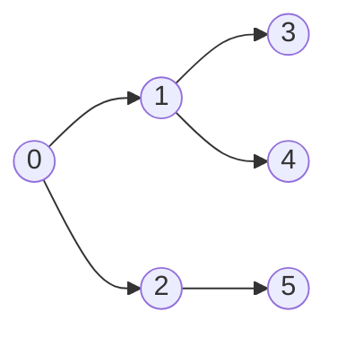

# 너비 우선 탐색 (BFS)

## 개념

**시작 노드에서 가까운 노드부터** 탐색합니다. 큐(Queue)를 사용하여 구현합니다.



탐색 순서: `0 → 1 → 2 → 3 → 4 → 5`

---

## 시간 복잡도

| | 복잡도 |
|--|--------|
| 시간 | O(V + E) |
| 공간 | O(V) |

V = 정점(Vertex) 수, E = 간선(Edge) 수

---

## 구현 (Python)

```python
from collections import deque

def bfs(graph, start):
    visited = {start}
    queue = deque([start])
    order = []

    while queue:
        node = queue.popleft()
        order.append(node)
        for neighbor in graph[node]:
            if neighbor not in visited:
                visited.add(neighbor)
                queue.append(neighbor)
    return order

graph = {
    0: [1, 2],
    1: [0, 3, 4],
    2: [0, 5],
    3: [1],
    4: [1],
    5: [2]
}
print(bfs(graph, 0))  # [0, 1, 2, 3, 4, 5]
```

---

## 최단 거리 계산

BFS는 **가중치 없는 그래프에서 최단 경로**를 찾을 수 있습니다.

```python
def bfs_shortest(graph, start, end):
    visited = {start}
    queue = deque([(start, 0)])   # (노드, 거리)

    while queue:
        node, dist = queue.popleft()
        if node == end:
            return dist
        for neighbor in graph[node]:
            if neighbor not in visited:
                visited.add(neighbor)
                queue.append((neighbor, dist + 1))
    return -1  # 도달 불가

print(bfs_shortest(graph, 0, 5))  # 2
```

---

## 2D 격자 BFS

코딩 테스트에서 가장 흔한 BFS 유형입니다.

```python
from collections import deque

def bfs_grid(grid, sr, sc):
    rows, cols = len(grid), len(grid[0])
    visited = [[False]*cols for _ in range(rows)]
    queue = deque([(sr, sc, 0)])
    visited[sr][sc] = True
    dirs = [(0,1),(0,-1),(1,0),(-1,0)]

    while queue:
        r, c, dist = queue.popleft()
        for dr, dc in dirs:
            nr, nc = r + dr, c + dc
            if 0 <= nr < rows and 0 <= nc < cols \
               and not visited[nr][nc] and grid[nr][nc] != '#':
                visited[nr][nc] = True
                queue.append((nr, nc, dist + 1))
```

---

## BFS vs DFS

| 항목 | BFS | DFS |
|------|-----|-----|
| 자료구조 | 큐 | 스택/재귀 |
| 최단 경로 | ✅ | ❌ (가중치 없을 때만 보장 X) |
| 메모리 | 많음 | 적음 |
| 적합한 문제 | 최단 거리, 레벨 순회 | 사이클 감지, 위상 정렬, 백트래킹 |

---

## 연습 문제

- BOJ 1260 - DFS와 BFS
- BOJ 2178 - 미로 탐색
- LeetCode 102 - Binary Tree Level Order Traversal
