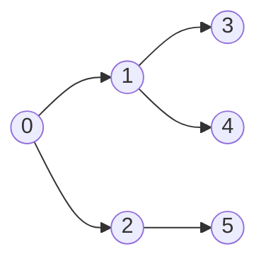

# 너비 우선 탐색 (BFS)

## 개념

**시작 노드에서 가까운 노드부터** 탐색합니다. 큐(Queue)를 사용하여 구현합니다.



탐색 순서: `0 → 1 → 2 → 3 → 4 → 5`

---

## 시간 복잡도

| | 복잡도 |
|--|--------|
| 시간 | O(V + E) |
| 공간 | O(V) |

V = 정점(Vertex) 수, E = 간선(Edge) 수

---

## 구현 (C++)

```cpp
#include <cstdio>
#include <cstring>

const int MAXV = 1005;
const int MAXE = 10005;

int head[MAXV], nxt[MAXE], to[MAXE], ecnt;
bool visited[MAXV];

void addEdge(int u, int v) {
    to[++ecnt] = v; nxt[ecnt] = head[u]; head[u] = ecnt;
}

int order[MAXV], orderCnt;

void bfs(int start) {
    int q[MAXV], front = 0, back = 0;
    memset(visited, false, sizeof(visited));
    visited[start] = true;
    q[back++] = start;
    orderCnt = 0;

    while (front < back) {
        int u = q[front++];
        order[orderCnt++] = u;
        for (int e = head[u]; e; e = nxt[e]) {
            if (!visited[to[e]]) {
                visited[to[e]] = true;
                q[back++] = to[e];
            }
        }
    }
}

int main() {
    // 그래프: 0-1, 0-2, 1-3, 1-4, 2-5
    addEdge(0, 1); addEdge(0, 2);
    addEdge(1, 0); addEdge(1, 3); addEdge(1, 4);
    addEdge(2, 0); addEdge(2, 5);
    addEdge(3, 1); addEdge(4, 1); addEdge(5, 2);

    bfs(0);
    for (int i = 0; i < orderCnt; i++)
        printf("%d ", order[i]);  // 0 1 2 3 4 5
    printf("\n");
    return 0;
}
```

---

## 최단 거리 계산

BFS는 **가중치 없는 그래프에서 최단 경로**를 찾을 수 있습니다.

```cpp
#include <cstdio>
#include <cstring>

const int MAXV = 1005;
const int MAXE = 10005;

int head[MAXV], nxt[MAXE], to[MAXE], ecnt;
int dist[MAXV];

void addEdge(int u, int v) {
    to[++ecnt] = v; nxt[ecnt] = head[u]; head[u] = ecnt;
}

int bfsShortest(int start, int end, int V) {
    memset(dist, -1, sizeof(int) * (V + 1));
    int q[MAXV], front = 0, back = 0;
    dist[start] = 0;
    q[back++] = start;

    while (front < back) {
        int u = q[front++];
        if (u == end) return dist[u];
        for (int e = head[u]; e; e = nxt[e]) {
            if (dist[to[e]] == -1) {
                dist[to[e]] = dist[u] + 1;
                q[back++] = to[e];
            }
        }
    }
    return -1;  // 도달 불가
}
```

---

## 2D 격자 BFS

코딩 테스트에서 가장 흔한 BFS 유형입니다.

```cpp
#include <cstdio>
#include <cstring>

const int MAXR = 1005;
const int MAXC = 1005;

char grid[MAXR][MAXC];
int  dist[MAXR][MAXC];
int  rows, cols;

int dx[] = {0, 0, 1, -1};
int dy[] = {1, -1, 0, 0};

struct Pos { int r, c; };

void bfsGrid(int sr, int sc) {
    Pos q[MAXR * MAXC];
    int front = 0, back = 0;

    memset(dist, -1, sizeof(dist));
    dist[sr][sc] = 0;
    q[back++] = {sr, sc};

    while (front < back) {
        Pos cur = q[front++];
        for (int d = 0; d < 4; d++) {
            int nr = cur.r + dx[d];
            int nc = cur.c + dy[d];
            if (nr >= 0 && nr < rows && nc >= 0 && nc < cols
                && dist[nr][nc] == -1 && grid[nr][nc] != '#') {
                dist[nr][nc] = dist[cur.r][cur.c] + 1;
                q[back++] = {nr, nc};
            }
        }
    }
}
```

---

## BFS vs DFS

| 항목 | BFS | DFS |
|------|-----|-----|
| 자료구조 | 큐 | 스택/재귀 |
| 최단 경로 | O (가중치 동일) | X |
| 메모리 | 많음 | 적음 |
| 적합한 문제 | 최단 거리, 레벨 순회 | 사이클 감지, 위상 정렬, 백트래킹 |

---

## 연습 문제

- BOJ 1260 - DFS와 BFS
- BOJ 2178 - 미로 탐색
- LeetCode 102 - Binary Tree Level Order Traversal
